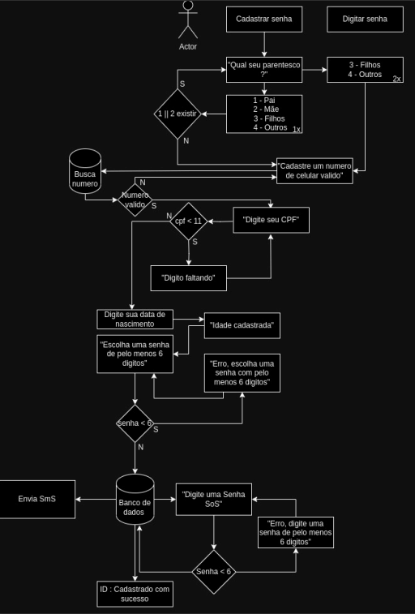

# Fechadura Digital
[Read-me em construcao] ....


Fechadura digital Baseada no bule de chá, com duas configuracoes diferentes, quando colocando a senha correta abrira 
todas as portas, se colocado uma senha que SOS já configurada no ato da configuracao inicial
será destrancadas apenas algumas portas, podendo ganhar tempo para ate a policia ser avisada, enviando imediatamente um SOS 
para a policia e mais uma para o numero já configurado como Patriarca/Matriarca.
Para esses casos nâo sera utilizada reconhecimeno facial apenas senha

* CRIACAO DE FECHADURA DIGITAL


* Cadastro de senha *



#### Ao escolher a opção de cadastrar a senha entra na opção de familiar entrando no menu com 4 opções
```
|----------------------------|
|1 - Pai (PATRIARCA)         |
|----------------------------|
|2 - Mae (MATRIARCA)         |
|----------------------------|
|3 - Filhos                  |
|----------------------------|
|4 - Outros                  |
|----------------------------|
```

Contendo dois tipos de **PATRIARCAS** **Pai** ou **Mãe**, será necessario para poder ter acesso as movimentações mais tarde

[READ-ME em contrucao] ...